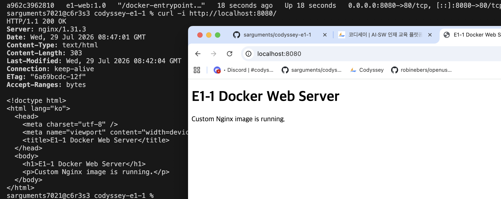

# Docker 실습 로그

## Docker 설치 및 기본 점검

### 실행 기록

```console
sarguments7021@c6r3s3 practice % docker --version
Docker version 28.5.2, build ecc6942

sarguments7021@c6r3s3 practice % docker info
Client:
 Version:    28.5.2
 Context:    orbstack
 Debug Mode: false
 Plugins:
  buildx: Docker Buildx (Docker Inc.)
    Version:  v0.29.1
    Path:     /Users/sarguments7021/.docker/cli-plugins/docker-buildx
  compose: Docker Compose (Docker Inc.)
    Version:  v2.40.3
    Path:     /Users/sarguments7021/.docker/cli-plugins/docker-compose

Server:
 Containers: 0
  Running: 0
  Paused: 0
  Stopped: 0
 Images: 0
 Server Version: 28.5.2
 Storage Driver: overlay2
  Backing Filesystem: btrfs
  Supports d_type: true
  Using metacopy: false
  Native Overlay Diff: true
  userxattr: false
 Logging Driver: json-file
 Cgroup Driver: cgroupfs
 Cgroup Version: 2
 Plugins:
  Volume: local
  Network: bridge host ipvlan macvlan null overlay
  Log: awslogs fluentd gcplogs gelf journald json-file local splunk syslog
 CDI spec directories:
  /etc/cdi
  /var/run/cdi
 Swarm: inactive
 Runtimes: io.containerd.runc.v2 runc
 Default Runtime: runc
 Init Binary: docker-init
 containerd version: 1c4457e00facac03ce1d75f7b6777a7a851e5c41
 runc version: d842d7719497cc3b774fd71620278ac9e17710e0
 init version: de40ad0
 Security Options:
  seccomp
   Profile: builtin
  cgroupns
 Kernel Version: 6.17.8-orbstack-00308-g8f9c941121b1
 Operating System: OrbStack
 OSType: linux
 Architecture: x86_64
 CPUs: 6
 Total Memory: 15.67GiB
 Name: orbstack
 ID: de2ea71f-eb4e-45b9-bfab-86b3ca0b6b17
 Docker Root Dir: /var/lib/docker
 Debug Mode: false
 Experimental: false
 Insecure Registries:
  ::1/128
  127.0.0.0/8
 Live Restore Enabled: false
 Product License: Community Engine
 Default Address Pools:
   Base: 192.168.97.0/24, Size: 24
   Base: 192.168.107.0/24, Size: 24
   Base: 192.168.117.0/24, Size: 24
   Base: 192.168.147.0/24, Size: 24
   Base: 192.168.148.0/24, Size: 24
   Base: 192.168.155.0/24, Size: 24
   Base: 192.168.156.0/24, Size: 24
   Base: 192.168.158.0/24, Size: 24
   Base: 192.168.163.0/24, Size: 24
   Base: 192.168.164.0/24, Size: 24
   Base: 192.168.165.0/24, Size: 24
   Base: 192.168.166.0/24, Size: 24
   Base: 192.168.167.0/24, Size: 24
   Base: 192.168.171.0/24, Size: 24
   Base: 192.168.172.0/24, Size: 24
   Base: 192.168.181.0/24, Size: 24
   Base: 192.168.183.0/24, Size: 24
   Base: 192.168.186.0/24, Size: 24
   Base: 192.168.207.0/24, Size: 24
   Base: 192.168.214.0/24, Size: 24
   Base: 192.168.215.0/24, Size: 24
   Base: 192.168.216.0/24, Size: 24
   Base: 192.168.223.0/24, Size: 24
   Base: 192.168.227.0/24, Size: 24
   Base: 192.168.228.0/24, Size: 24
   Base: 192.168.229.0/24, Size: 24
   Base: 192.168.237.0/24, Size: 24
   Base: 192.168.239.0/24, Size: 24
   Base: 192.168.242.0/24, Size: 24
   Base: 192.168.247.0/24, Size: 24
   Base: fd07:b51a:cc66:d000::/56, Size: 64

WARNING: DOCKER_INSECURE_NO_IPTABLES_RAW is set
```

### 확인 내용

- `docker --version`이 `Docker version 28.5.2`를 출력했다.
- `docker info`의 `Server` 정보가 출력되어 Docker 데몬이 실행 중임을 확인했다.

## Docker 기본 운영 명령

### 이미지

#### 실행 기록

```console
sarguments7021@c6r3s3 practice % docker pull nginx:alpine
alpine: Pulling from library/nginx
55afa1ecc21d: Pull complete
3cd534fe98c6: Pull complete
1223f016b4e4: Pull complete
62bec68d7c31: Pull complete
46f977ee452f: Pull complete
d0008c891db4: Pull complete
390dc935348d: Pull complete
46519e7231d2: Pull complete
Digest: sha256:4a73073bd557c65b759505da037898b61f1be6cbcc3c2c3aeac22d2a470c1752
Status: Downloaded newer image for nginx:alpine
docker.io/library/nginx:alpine

sarguments7021@c6r3s3 practice % docker images nginx:alpine
REPOSITORY   TAG       IMAGE ID       CREATED       SIZE
nginx        alpine    f0ba77f796e5   13 days ago   62.4MB
```

#### 확인 내용

- `docker pull nginx:alpine`이 `Status: Downloaded newer image for nginx:alpine`으로 완료됐다.
- `docker images nginx:alpine` 목록에 `nginx:alpine` 이미지가 표시됐다.

#### 이미지 이름 설명

- `nginx:alpine`에서 콜론 앞의 `nginx`는 이미지 이름이다. 레지스트리를 생략했으므로 Docker Hub의 공식 Nginx 이미지를 뜻하며, 실제 내려받기 출력에는 `docker.io/library/nginx:alpine`으로 표시된다.
- 콜론 뒤의 `alpine`은 태그(tag)다. Alpine Linux 기반으로 만든 Nginx 이미지 변형을 선택한다.
- 태그를 생략하면 기본 태그인 `latest`를 사용한다. 같은 이미지라도 태그에 따라 기반 운영체제나 포함된 버전이 달라질 수 있다.

### 컨테이너와 운영

#### 실행 기록

```console
sarguments7021@c6r3s3 practice % docker run -d --name e1-nginx-basic nginx:alpine
94a95210b14ccf33ab7bf67f340a4b72ad630878e5317007c5ea36d1a864da28

sarguments7021@c6r3s3 practice % docker ps --filter name=e1-nginx-basic
CONTAINER ID   IMAGE          COMMAND                  CREATED          STATUS          PORTS     NAMES
94a95210b14c   nginx:alpine   "/docker-entrypoint.…"   18 seconds ago   Up 17 seconds   80/tcp    e1-nginx-basic

sarguments7021@c6r3s3 practice % docker logs e1-nginx-basic
/docker-entrypoint.sh: /docker-entrypoint.d/ is not empty, will attempt to perform configuration
/docker-entrypoint.sh: Looking for shell scripts in /docker-entrypoint.d/
/docker-entrypoint.sh: Launching /docker-entrypoint.d/10-listen-on-ipv6-by-default.sh
10-listen-on-ipv6-by-default.sh: info: Getting the checksum of /etc/nginx/conf.d/default.conf
10-listen-on-ipv6-by-default.sh: info: Enabled listen on IPv6 in /etc/nginx/conf.d/default.conf
/docker-entrypoint.sh: Sourcing /docker-entrypoint.d/15-local-resolvers.envsh
/docker-entrypoint.sh: Launching /docker-entrypoint.d/20-envsubst-on-templates.sh
/docker-entrypoint.sh: Launching /docker-entrypoint.d/30-tune-worker-processes.sh
/docker-entrypoint.sh: Configuration complete; ready for start up
2026/07/29 08:26:40 [notice] 1#1: using the "epoll" event method
2026/07/29 08:26:40 [notice] 1#1: nginx/1.31.3
2026/07/29 08:26:40 [notice] 1#1: built by gcc 15.2.0 (Alpine 15.2.0)
2026/07/29 08:26:40 [notice] 1#1: OS: Linux 6.17.8-orbstack-00308-g8f9c941121b1
2026/07/29 08:26:40 [notice] 1#1: getrlimit(RLIMIT_NOFILE): 20480:1048576
2026/07/29 08:26:40 [notice] 1#1: start worker processes
2026/07/29 08:26:40 [notice] 1#1: start worker process 30
2026/07/29 08:26:40 [notice] 1#1: start worker process 31
2026/07/29 08:26:40 [notice] 1#1: start worker process 32
2026/07/29 08:26:40 [notice] 1#1: start worker process 33
2026/07/29 08:26:40 [notice] 1#1: start worker process 34
2026/07/29 08:26:40 [notice] 1#1: start worker process 35

sarguments7021@c6r3s3 practice % docker stats --no-stream e1-nginx-basic
CONTAINER ID   NAME             CPU %     MEM USAGE / LIMIT     MEM %     NET I/O         BLOCK I/O         PIDS
94a95210b14c   e1-nginx-basic   0.00%     9.523MiB / 15.67GiB   0.06%     1.66kB / 126B   10.2MB / 8.19kB   7

sarguments7021@c6r3s3 practice % docker stop e1-nginx-basic
e1-nginx-basic

sarguments7021@c6r3s3 practice % docker ps -a --filter name=e1-nginx-basic
CONTAINER ID   IMAGE          COMMAND                  CREATED              STATUS                      PORTS     NAMES
94a95210b14c   nginx:alpine   "/docker-entrypoint.…"   About a minute ago   Exited (0) 16 seconds ago             e1-nginx-basic
```

#### 확인 내용

- `docker ps`에 `e1-nginx-basic`이 `Up` 상태로 표시됐다.
- `docker logs`에서 Nginx 설정 완료와 `nginx/1.31.3` 시작 로그를 확인했다.
- `docker stats --no-stream`이 CPU·메모리·네트워크 사용량을 한 번 출력했다.
- 컨테이너를 중지한 뒤 `docker ps -a`에 `e1-nginx-basic`이 `Exited (0)` 상태로 표시됐다.

#### `--no-stream` 옵션 설명

- `docker stats`는 기본적으로 CPU·메모리 등의 수치를 계속 갱신하며 출력한다.
- `--no-stream`을 붙이면 현재 시점의 수치를 한 번만 출력하고 명령을 종료한다.
- 실습 기록에는 한 번의 결과만 남기기 쉽기 때문에 `--no-stream`을 사용한다.

## 컨테이너 실행 실습

### hello-world

#### 실행 기록

```console
sarguments7021@c6r3s3 practice % docker run hello-world
Unable to find image 'hello-world:latest' locally
latest: Pulling from library/hello-world
4f55086f7dd0: Pull complete
Digest: sha256:c3cbe1cc1aa588a64951ac6286e0df7b27fe2e6324b1001c619bb358770c0178
Status: Downloaded newer image for hello-world:latest

Hello from Docker!
This message shows that your installation appears to be working correctly.

To generate this message, Docker took the following steps:
 1. The Docker client contacted the Docker daemon.
 2. The Docker daemon pulled the "hello-world" image from the Docker Hub.
    (amd64)
 3. The Docker daemon created a new container from that image which runs the
    executable that produces the output you are currently reading.
 4. The Docker daemon streamed that output to the Docker client, which sent it
    to your terminal.

To try something more ambitious, you can run an Ubuntu container with:
 $ docker run -it ubuntu bash

Share images, automate workflows, and more with a free Docker ID:
 https://hub.docker.com/

For more examples and ideas, visit:
 https://docs.docker.com/get-started/
```

#### 확인 내용

- `Hello from Docker!` 성공 메시지가 출력됐다.

### Ubuntu 컨테이너

#### 실행 기록

```console
sarguments7021@c6r3s3 practice % docker run -it --name e1-ubuntu-cli ubuntu bash
Unable to find image 'ubuntu:latest' locally
latest: Pulling from library/ubuntu
ed819469700f: Pull complete
a3679419df18: Pull complete
Digest: sha256:3131b4cc82a783df6c9df078f86e01819a13594b865c2cad47bd1bca2b7063bb
Status: Downloaded newer image for ubuntu:latest
root@97b29cfb51d9:/# ls
bin  boot  dev  etc  home  lib  lib64  media  mnt  opt  proc  root  run  sbin  srv  sys  tmp  usr  var

root@97b29cfb51d9:/# echo "Ubuntu container"
Ubuntu container

root@97b29cfb51d9:/# exit
exit
```

#### 확인 내용

- Ubuntu 컨테이너 안에서 `ls`가 디렉터리 목록을, `echo`가 `Ubuntu container`를 출력했다.

### 컨테이너 종료와 유지

#### 실행 기록

```console
sarguments7021@c6r3s3 practice % docker run -dit --name e1-attach-test ubuntu bash -i
b6159afe02c84407c1b6659d2b8ffa3e10de1cde7ab1e0491edd6c1e9e501452

sarguments7021@c6r3s3 practice % docker attach e1-attach-test

root@b6159afe02c8:/# exit
exit

sarguments7021@c6r3s3 practice % docker ps -a --filter name=e1-attach-test
CONTAINER ID   IMAGE     COMMAND     CREATED         STATUS                      PORTS     NAMES
b6159afe02c8   ubuntu    "bash -i"   6 minutes ago   Exited (0) 22 seconds ago             e1-attach-test

sarguments7021@c6r3s3 practice % docker run -dit --name e1-exec-test ubuntu sleep infinity
76733b2a5c03e119d597c65b8d7a7287fd40c604e8a8a4dab9c24ee39c80266f

sarguments7021@c6r3s3 practice % docker exec -it e1-exec-test bash
root@76733b2a5c03:/# exit
exit

sarguments7021@c6r3s3 practice % docker ps --filter name=e1-exec-test
CONTAINER ID   IMAGE     COMMAND            CREATED              STATUS              PORTS     NAMES
76733b2a5c03   ubuntu    "sleep infinity"   About a minute ago   Up About a minute             e1-exec-test
```

#### 명령 구성

- `docker run`: 이미지를 바탕으로 컨테이너를 만들고 실행한다.
- `-dit`: `-d -i -t`를 붙여 쓴 것이다.
  - `-d`: 터미널을 점유하지 않고 백그라운드에서 실행한다.
  - `-i`: 컨테이너의 표준 입력을 열어 둔다.
  - `-t`: 가상 터미널을 할당한다.
- `--name e1-attach-test`: 컨테이너 이름을 지정한다.
- `ubuntu`: 실행할 이미지다.
- `bash -i`: 컨테이너 안에서 Bash를 실행하고, Bash의 `-i`로 대화형 셸로 실행한다.

#### `-i`가 두 번 있는 이유

- `-dit` 안의 `-i`는 Docker 옵션이다. Docker가 컨테이너 표준 입력을 열어 두므로 `docker attach` 후 입력을 전달할 수 있다.
- `bash -i`의 `-i`는 Bash 옵션이다. Bash가 프롬프트를 띄우고 입력을 받는 대화형 셸로 동작하게 한다.
- 같은 글자지만 Docker와 Bash가 각각 해석하므로 중복 옵션이 아니다. 이 실습에서는 Docker의 입출력 연결과 컨테이너 안 Bash의 대화형 동작을 모두 필요로 한다.

#### 확인 내용

- `attach`로 연결한 Bash를 종료하자 `e1-attach-test`이 `Exited (0)` 상태가 됐다.
- `exec`로 시작한 별도 Bash를 종료한 뒤에도 `e1-exec-test`은 `Up` 상태로 유지됐다.

#### 설명

- `attach`는 컨테이너의 주 프로세스 입출력에 연결한다. 이 실습에서는 주 프로세스인 Bash를 종료하므로 컨테이너도 종료된다.
- `exec`는 실행 중인 컨테이너 안에서 별도 프로세스를 실행한다. 이 실습에서는 Bash만 종료되고, 주 프로세스인 `sleep infinity`는 계속 실행된다.

## Dockerfile 기반 커스텀 이미지

### 선택한 베이스 이미지

- 선택한 기존 베이스 이미지: `nginx:alpine`
- 선택 이유: Nginx가 포함돼 정적 웹 페이지를 바로 제공할 수 있고, Alpine 기반이라 이미지가 가볍다.
- 선택 방식: A. 웹 서버 베이스 이미지에 정적 콘텐츠를 교체하는 방식
- Dockerfile: [src/Dockerfile](../src/Dockerfile)

### 적용한 커스텀

- 커스텀 내용: `index.html`을 Nginx 기본 웹 루트에 복사한다.
- 목적: 기본 페이지 대신 내 페이지를 보여 준다.
- 추가 커스텀 내용: `ENV APP_ENV=dev`
- 목적: 컨테이너 안의 기본 환경 변수 `APP_ENV`를 `dev`로 설정한다.
- 추가 커스텀 내용: `LABEL org.opencontainers.image.title="e1-web"`
- 목적: 이미지 제목을 나타내는 메타데이터를 설정한다.

### 실행 기록

```console
sarguments7021@c6r3s3 codyssey-e1-1 % docker build -t e1-web:1.0 ./src
[+] Building 1.8s (7/7) FINISHED                                                                                          docker:orbstack
 => [internal] load build definition from Dockerfile                                                                                 0.2s
 => => transferring dockerfile: 170B                                                                                                 0.0s
 => [internal] load metadata for docker.io/library/nginx:alpine                                                                      0.0s
 => [internal] load .dockerignore                                                                                                    0.2s
 => => transferring context: 60B                                                                                                     0.0s
 => [internal] load build context                                                                                                    0.3s
 => => transferring context: 342B                                                                                                    0.0s
 => [1/2] FROM docker.io/library/nginx:alpine                                                                                        0.8s
 => [2/2] COPY index.html /usr/share/nginx/html/index.html                                                                           0.1s
 => exporting to image                                                                                                               0.2s
 => => exporting layers                                                                                                              0.1s
 => => writing image sha256:1c776491ab7860d7888c233c6264e1c71bc9bda8330ea55c7365448df29c3555                                         0.0s
 => => naming to docker.io/library/e1-web:1.0                                                                                        0.0s

sarguments7021@c6r3s3 codyssey-e1-1 % docker run -d --name e1-web e1-web:1.0
43cfb4b5aaa770602899a4dbaf807493e66142a046d07603948ee8c4bb61fb15

sarguments7021@c6r3s3 codyssey-e1-1 % docker ps --filter name=e1-web
CONTAINER ID   IMAGE        COMMAND                  CREATED          STATUS          PORTS     NAMES
43cfb4b5aaa7   e1-web:1.0   "/docker-entrypoint.…"   14 seconds ago   Up 13 seconds   80/tcp    e1-web

sarguments7021@c6r3s3 codyssey-e1-1 % docker exec e1-web printenv APP_ENV
dev
```

### 확인 내용

- `docker build -t e1-web:1.0 ./src`가 `FINISHED`로 완료되고 이미지가 `e1-web:1.0`으로 생성됐다.
- `docker ps`에 `e1-web` 컨테이너가 `e1-web:1.0` 이미지로 `Up` 상태로 표시됐다.
- `docker exec e1-web printenv APP_ENV`가 `dev`를 출력했다.

### 설명

- 이미지는 실행 환경과 설정을 정의한 템플릿이고, 컨테이너는 이미지를 실제로 실행한 인스턴스다.
- Dockerfile의 `FROM`은 기존 베이스 이미지를 선택한다. 그 뒤 `COPY`, `RUN`, `ENV` 등의 명령으로 필요한 커스텀을 적용할 수 있다.
- 이 이미지에서는 `nginx:alpine`을 베이스로 선택하고, `COPY index.html /usr/share/nginx/html/index.html`로 정적 페이지를 교체한다.
- `ENV APP_ENV=dev`는 컨테이너 안의 기본 환경 변수 값을 설정한다. Nginx의 동작을 자동으로 바꾸지는 않지만, 애플리케이션이나 실행 스크립트가 이 값을 읽어 환경별 동작을 정할 수 있다.

### Dockerfile 명령 설명

- `FROM nginx:alpine`
  - 새 이미지의 바탕이 되는 기존 이미지를 선택한다.
  - 이 프로젝트에서는 Nginx가 포함된 가벼운 이미지를 사용한다.
- `LABEL org.opencontainers.image.title="e1-web"`
  - 이미지 제목을 나타내는 메타데이터를 설정한다.
- `COPY index.html /usr/share/nginx/html/index.html`
  - 파일을 이미지 안으로 복사한다.
  - 이 프로젝트에서는 기본 페이지 대신 내 페이지를 넣는다.
- `RUN <명령>`
  - 이미지를 만들 때 명령을 실행한다.
  - 예: 패키지 설치
  - 현재 Dockerfile에서는 사용하지 않는다.
- `ENV APP_ENV=dev`
  - 컨테이너 안의 기본 환경 변수 `APP_ENV`를 `dev`로 설정한다.

## 포트 매핑 및 접속

### 실행 기록

```console
sarguments7021@c6r3s3 codyssey-e1-1 % docker run -d --name e1-web-port -p 8080:80 e1-web:1.0
a962c3962810fb2a388c9e217521aa382b3f6565279ccbc473c9de78ab6710ea

sarguments7021@c6r3s3 codyssey-e1-1 % docker ps --filter name=e1-web-port
CONTAINER ID   IMAGE        COMMAND                  CREATED          STATUS          PORTS                                     NAMES
a962c3962810   e1-web:1.0   "/docker-entrypoint.…"   18 seconds ago   Up 18 seconds   0.0.0.0:8080->80/tcp, [::]:8080->80/tcp   e1-web-port

sarguments7021@c6r3s3 codyssey-e1-1 % curl -i http://localhost:8080/
HTTP/1.1 200 OK
Server: nginx/1.31.3
Date: Wed, 29 Jul 2026 08:47:01 GMT
Content-Type: text/html
Content-Length: 303
Last-Modified: Wed, 29 Jul 2026 08:42:04 GMT
Connection: keep-alive
ETag: "6a69bcdc-12f"
Accept-Ranges: bytes

<!doctype html>
<html lang="ko">
  <head>
    <meta charset="utf-8" />
    <meta name="viewport" content="width=device-width, initial-scale=1" />
    <title>E1-1 Docker Web Server</title>
  </head>
  <body>
    <h1>E1-1 Docker Web Server</h1>
    <p>Custom Nginx image is running.</p>
  </body>
</html>
```

### 명령 구성

- `-d`: 컨테이너를 백그라운드에서 실행한다.
- `--name <컨테이너-이름>`: 컨테이너 이름을 지정한다.
- `-p <호스트-포트>:<컨테이너-포트>`: 왼쪽 호스트 포트와 오른쪽 컨테이너 포트를 연결한다.
- `curl -i <URL>`: HTTP 요청을 보내고, 응답 본문뿐 아니라 응답 헤더도 함께 출력한다.
  - `-i`는 curl의 `--include` 옵션이며, Docker나 Bash의 `-i`와 다른 옵션이다.
  - 출력의 `HTTP/1.1 200 OK`는 요청이 성공했고 서버가 정상 응답했다는 뜻이다.
  - 빈 줄 위는 상태 줄과 응답 헤더, 빈 줄 아래는 HTML 응답 본문이다.

### 확인 내용

- `docker ps`에 `0.0.0.0:8080->80/tcp` 포트 연결이 표시됐다.
- `curl -i http://localhost:8080/`이 `HTTP/1.1 200 OK`와 커스텀 HTML 페이지를 출력했다.

### 설명

- 컨테이너 내부 포트는 기본적으로 호스트에서 직접 접근할 수 없다. 포트 매핑은 호스트 포트를 컨테이너 포트에 연결해 호스트에서 서비스에 접근할 수 있게 한다.
- 예를 들어 `-p 8080:80`이면 `localhost:8080` 요청이 Docker를 거쳐 컨테이너의 `80` 포트로 전달된다.

### 접속 증거

[](../evidence/docker-port-for.png)

## 바인드 마운트 반영

### 실행 기록

```console
sarguments7021@c6r3s3 codyssey-e1-1 % mkdir -p practice/bind-mount
sarguments7021@c6r3s3 codyssey-e1-1 % printf '<h1>before</h1>\n' > practice/bind-mount/index.html
sarguments7021@c6r3s3 codyssey-e1-1 % docker run -d --name e1-web-bind -p 8081:80 -v "$PWD/practice/bind-mount:/usr/share/nginx/html:ro" nginx:alpine
1f2dd46198de2893d4a8819fa49833868437ffd72c056efd38fed345560d35af

sarguments7021@c6r3s3 codyssey-e1-1 % curl -s http://localhost:8081/
<h1>before</h1>

sarguments7021@c6r3s3 codyssey-e1-1 % printf '<h1>afteer</h1>\n' > practice/bind-mount/index.html
sarguments7021@c6r3s3 codyssey-e1-1 % curl -s http://localhost:8081
<h1>afteer</h1>
```

### 명령 구성

- `docker run`의 `-v`는 `--volume`의 짧은 옵션이다. 호스트의 `practice/bind-mount` 디렉터리를 Nginx가 정적 파일을 읽는 `/usr/share/nginx/html`에 연결하기 위해 사용했다. 이 옵션이 없으면 호스트에서 `index.html`을 수정해도 컨테이너의 웹 루트에는 반영되지 않는다.
- `-v <호스트-경로>:<컨테이너-경로>:ro`에서 왼쪽은 호스트 경로, 가운데는 컨테이너 경로다.
- `ro`는 컨테이너에서 마운트한 파일을 읽기 전용으로 사용한다는 뜻이다.
- `curl`의 `-s`는 `--silent`의 짧은 옵션이다. 진행 상태 표시를 숨기고 응답 본문만 출력하므로, 파일을 수정하기 전후의 HTML 응답을 비교하기 쉽다. 오류 메시지도 함께 보고 싶을 때는 `-sS`를 사용하거나 `-s`를 뺀다.

### `-v`와 Docker 볼륨의 차이

- `-v`는 바인드 마운트와 Docker 볼륨 모두를 연결할 수 있는 마운트 옵션이다. 따라서 `-v`를 사용했다고 해서 항상 Docker 볼륨을 만든 것은 아니다.
- 이 실습의 `-v "$PWD/practice/bind-mount:..."`에서는 왼쪽 값이 호스트의 실제 경로이므로 **바인드 마운트**다. 반면 볼륨 영속성 실습의 `-v e1-data:/data`에서는 왼쪽 값 `e1-data`가 Docker가 관리하는 **이름 있는 볼륨**이다.
- 긴 문법인 `--mount`는 연결 종류를 직접 적을 수 있어 구분하기 쉽다. 아래 명령은 각각 위 `-v` 예시와 같은 뜻이며, `-v`와 함께 쓰지 않고 하나만 사용한다.

```console
# 바인드 마운트
docker run --mount type=bind,source="$PWD/practice/bind-mount",target=/usr/share/nginx/html,readonly nginx:alpine

# 이름 있는 Docker 볼륨
docker run --mount type=volume,source=e1-data,target=/data ubuntu sleep infinity
```

### 변경 전후

- 변경 전: 호스트의 `index.html`과 `curl -s http://localhost:8081/` 응답이 모두 `<h1>before</h1>`이었다.
- 호스트 파일 변경: `printf '<h1>afteer</h1>\n' > practice/bind-mount/index.html`로 파일 내용을 수정했다.
- 변경 후: 컨테이너를 다시 만들지 않았지만 `curl -s http://localhost:8081/` 응답이 `<h1>afteer</h1>`로 즉시 바뀌었다.

### 확인 내용

- 호스트 파일을 수정한 결과가 실행 중인 컨테이너의 HTTP 응답에 즉시 반영됐다. 따라서 호스트 경로가 컨테이너의 웹 루트에 바인드 마운트됐음을 확인했다.

### 설명

- 바인드 마운트는 호스트의 특정 경로를 컨테이너 경로에 직접 연결한다.
- 호스트 파일을 수정한 뒤 컨테이너에서 바로 변경 내용을 확인해야 하는 개발 환경에 적합하다.

## Docker 볼륨 영속성

### 실행 기록

```console
sarguments7021@c6r3s3 codyssey-e1-1 % docker volume create e1-data
e1-data

sarguments7021@c6r3s3 codyssey-e1-1 % docker run -d --name e1-volume-first -v e1-data:/data ubuntu sleep infinity
06a79f4ef27b5937d62cb1d112b865dc0e51a63fe1f8ce28d19a3883a29b3fd3

sarguments7021@c6r3s3 codyssey-e1-1 % docker exec e1-volume-first bash -c 'echo "volume-data" > /data/hello.txt && cat /data/hello.txt'
volume-data

sarguments7021@c6r3s3 codyssey-e1-1 % docker rm -f e1-volume-first
e1-volume-first

sarguments7021@c6r3s3 codyssey-e1-1 % docker run -d --name e1-volume-second -v e1-data:/data ubuntu sleep infinity
f9a45400b8f8fa355aaac0bb4cbc254bfc5cb4d493db59b74cfe944480247bb6

sarguments7021@c6r3s3 codyssey-e1-1 % docker exec e1-volume-second bash -c 'cat /data/hello.txt'
volume-data
```

### 명령 구성

- `docker exec`는 실행 중인 컨테이너 안에서 명령을 실행한다.
- `bash`는 컨테이너 안에서 실행할 셸이다.
- `-c`는 뒤의 따옴표로 묶인 문자열을 Bash 명령으로 실행하는 옵션이다.

### 삭제 전후

- 컨테이너 삭제 전: `e1-volume-first`에서 `/data/hello.txt`에 `volume-data`를 작성하고 같은 값을 읽었다.
- 컨테이너 삭제 후 새 컨테이너: `e1-volume-first`를 삭제한 뒤 `e1-volume-second`에서 같은 파일의 `volume-data`를 읽었다.

### 확인 내용

- 두 컨테이너가 같은 `e1-data` 볼륨을 사용했으므로, 컨테이너를 삭제해도 볼륨 데이터가 유지됨을 확인했다.

### 설명

- Docker 볼륨은 컨테이너 파일 시스템과 분리되어 관리된다. 같은 볼륨을 새 컨테이너에 연결하면 이전 컨테이너가 삭제된 뒤에도 데이터를 사용할 수 있다.
- 바인드 마운트는 호스트 경로를 직접 사용하고, Docker 볼륨은 Docker가 관리하는 저장 공간을 사용한다.
